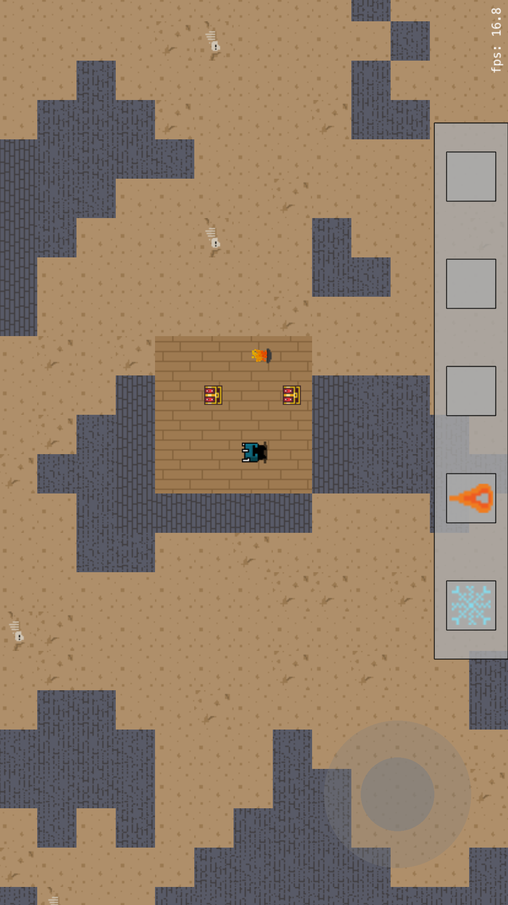
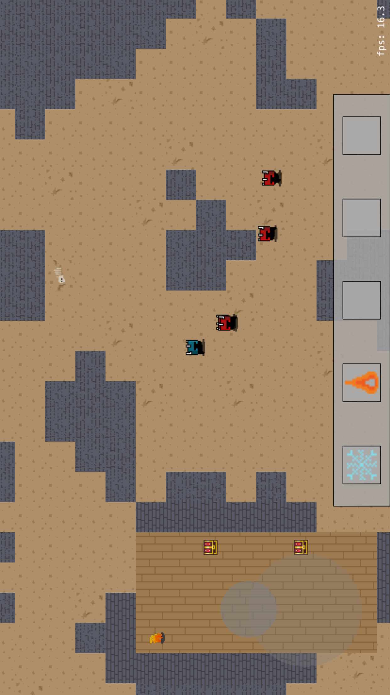
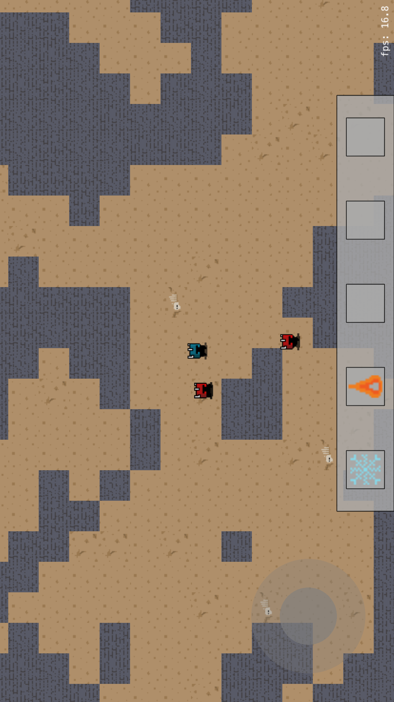

# DungeonMaster_iOS
## Intro
The following is a dungeon crawler proof-of-concept game written using SpriteKit.

#### Advanced animations
Various advanced animations are used throughout the app including player running animations, a dynamic arrow aiming HUD, sprite collision, fire and ice particle effects, and more.

#### A\* pathfinding
the [A\* pathfinding algorithim](https://en.wikipedia.org/wiki/A*_search_algorithm) is an advanced method used to quickly and efficiently find the path of least resistance from one point to another on a map. In this game, pathfinding is used in two seperate scenarios:
* A user can tap any part of the scene and the warrior will automatically pathfind to that location
* All enemies on the map will pathfind to the warrior when within a certain range

#### Procedural dungeon generation
When the app is first loaded, a blank canvas is initiated and populated randomly with walls. The dungeon is then cleaned up by counting each cells neighbor walls to generate caves. Caves are then identified and disconnected caverns are removed. Disconnected walls are also removed. After this, dungeons of varying sizes are created and populated with random treasure chests. Floor patterns and wall patters are randomized and fires are added to dungeons.

## Work in progress
* Multiplayer matchfinding and gameplay via bluetooth

## Installation
No extra installation efforts are required. The following is used in this app:
* [SpriteKit](https://developer.apple.com/spritekit/) - game driver

## Images
#### Procedural generation

#### Pathfinding

